# Is Your Song a Banger or a Dud?
Galvanize Capstone Project: Is Your Song a Banger or a Dud?

## Objective
The objecive of this project is to make a model that can predict if a song can make it to the Billboard Hot 100 Chart. The model we end up with is a Hyperparameter Tuned Random Forest Model that uses a song's features such as tempo, valence, liveliness etc., to make it's prediction. 

## Understanding the Motivation / Potential Use-Cases TODO
The primary motivation of this project is money with the target enitities being Record Labels or Music Artists.
It can be extremely lucrative if there is a way to stop either a Record Label or an individual artist from wasting their capital and time on songs that are mathematically proven to not be a success and instead divert those valuable resources to songs that can be popular.

## Proposed Solution 
The proposed solution is to make a model that can predict the success of a song. Success for this predictive model is defined as if the song in question can land any spot on Billboard's U.S Hot 100 Chart.

## Data - Datasets Origin
The data was scraped by another data scientist and comes from Billboard’s The Hot 100 chart:  
* The Hot 100 Chart covers the top songs in the United States every week all the way since the Chart’s inception in 1958. 
  * [https://data.world/kcmillersean/billboard-hot-100-1958-2017](https://data.world/kcmillersean/billboard-hot-100-1958-2017)
* I also used a kaggle dataset to splice in random tracks so there is a balance between the number of tracks that made it to the top and those that didn’t.
  * [https://www.kaggle.com/yamaerenay/spotify-dataset-19212020-160k-tracks](https://www.kaggle.com/yamaerenay/spotify-dataset-19212020-160k-tracks) [Removed as of September 2, 2021]

## Data
The structure of the cleaned data was a list of 48 thousand songs where each entry is a song with some of its properties. This is a list of all the properties:
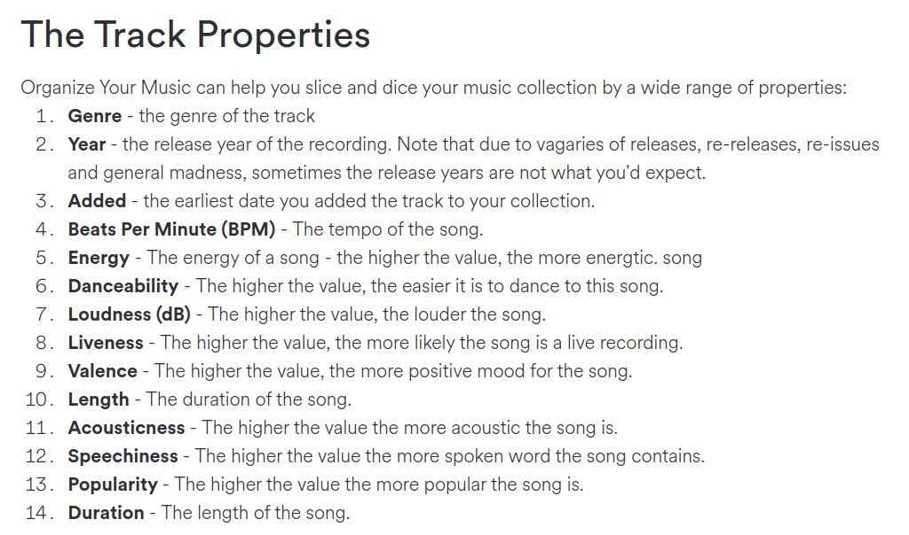
An example of an entry of the dataset is: 
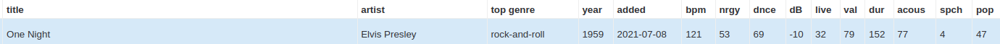

An additional column is added where the value is one hot encoded if the song reached the top 100 chart. 
This plot shows the structure of the cleaned dataset.
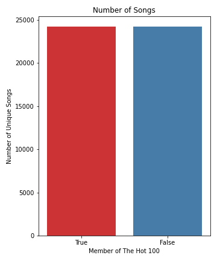

## Methodology
### The Models
We'll start with a `train_test_split` to get our Training and Test Data.

Our baseline will be a Logistic Regression Model where the features are the track properties columns and the target is the one hot encoded column that denotes if the track is a member of the Hot 100 Chart.

We will then use a Decision Tree, followed by a Random Forest. Hyper Parameter tuning will be tried for every applicable model.

There are three performance metrics I considered, Accuracy, Precision, and Recall. For this particular objective, they can be defined as such:

* Accuracy : (number of correct predicitions) / (total number of predictions)
* Precision : (number of true positives) / (Actual results aka [True Positive + False Positive])
* Recall : (number of true positives) / (Predicted Results aka [True Positive + False Negative])

We must also determine what true positive, true negative, false positive and false negative mean in relation to our problem. Once we verbalize that, we can choose the appropriate performance metric to use.

True Postive : Our model predicted that the song can make it to the Billboard Hot 100 Chart and it actually made it to the Hot 100 Chart.
True Negative : Our model predicted that the song can not make it to the Billboard Hot 100 Chart and it actually did not make it to the Hot 100 Chart.
False Positive : Our model predicted that the song can make it to the Billboard Hot 100 Chart but in actuality it did not make it to the Hot 100 Chart.
False Negative : Our model predicted that the song can not make it to the Billboard Hot 100 Chart but in actuality it did make it to the Hot 100 Chart.

I will be choosing the performance metric Precision to focus on. The explanation for why Precision is important can be found in the Results section where the values of the metrics for each model is shown.

#### Logistic Regression
|  | |
|:-------------------------:|:-------------------------:|
|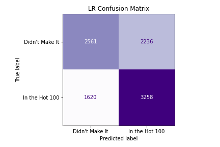 | 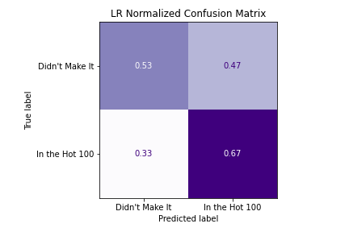|

|  | Accuracy | Precision | Recall |
|:----------:|:---------------:| :---: | :---: |
| Logistic Regression | 0.601 | 0.668 | 0.593 |

I used a Logistic Regression model as a baseline. It was better than a random guess at a little over 50%. 

I also found the Coefficients for each Track property for the best model after hyper parameter tuning.

Since this is just the baseline model we move onto something a bit more promising. 

#### Decision Trees
|  | |
|:-------------------------:|:-------------------------:|
|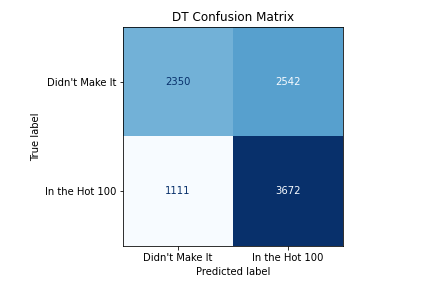 | 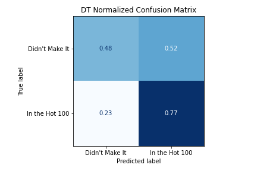|

|  | Accuracy | Precision | Recall |
|:----------:|:---------------:| :---: | :---: |
| Decision Tree | 0.622 | 0.768 | 0.591 |

After hyper-parameter tuning, we see a signficant boost in all of the performance metrics.

|_ |_|
|:-------------------------:|:-------------------------:|
|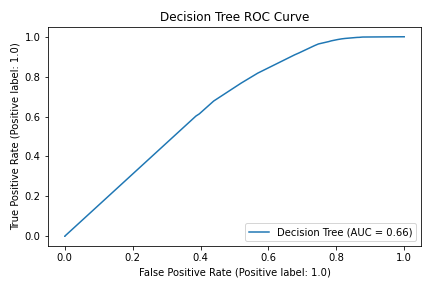 | 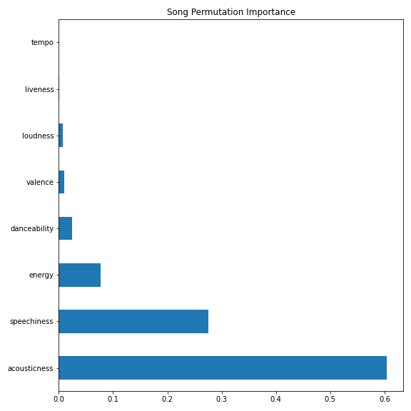|

We see that from the Permutation Importance that acousticness has more of an effect on the model's predictive than any other property. However it seems unlikely that two of the several metrics don't have any effect at all, so we'll use something more robust than a Decision Tree; multiple Decision Trees, or a Random Forest.

#### Random Forest
|_ |_|
|:-------------------------:|:-------------------------:|
|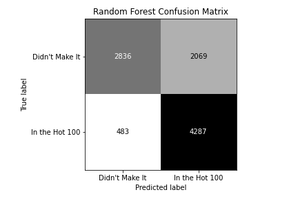 | 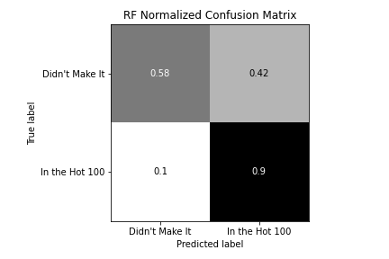|

|  | Accuracy | Precision | Recall |
|:----------:|:---------------:| :---: | :---: |
| Random Forest | 0.736 | 0.899 | 0.674 |

After hyper-parameter tuning, all of our performance metrics increase. We then 

|_ |_|
|:-------------------------:|:-------------------------:|
| | 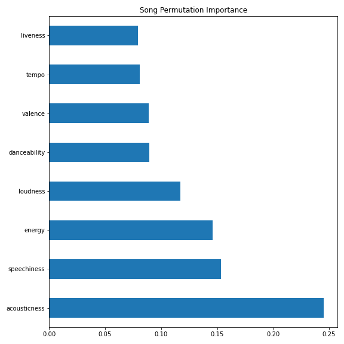|

## Results
The results of the each of the models are shown in the table below:

|            |  Accuracy | Precision | Recall |
|:----------:|:--------------:| :---: | :---: |
| Logistic Regression | 0.601 | 0.668 | 0.593 |
| Decision Tree | 0.622 | 0.768 | 0.591 |
| Random Forest | 0.736 | 0.899 | 0.674 |

## Conclusions / Future-Steps

